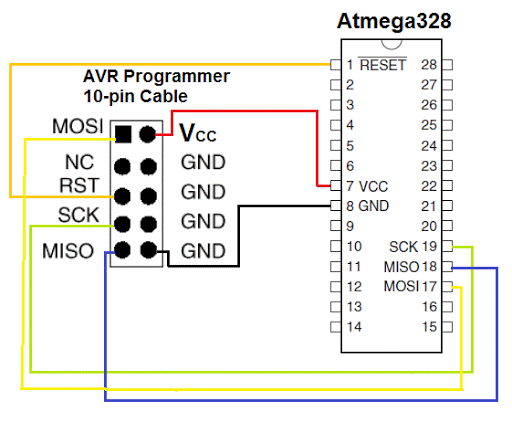
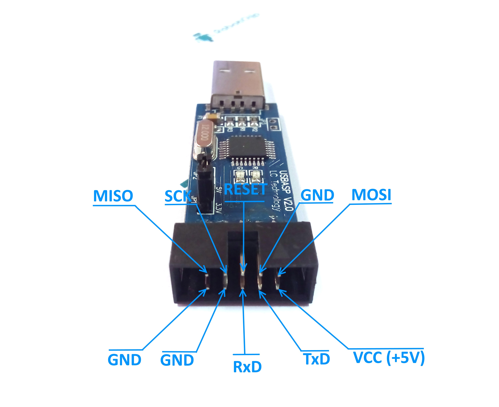
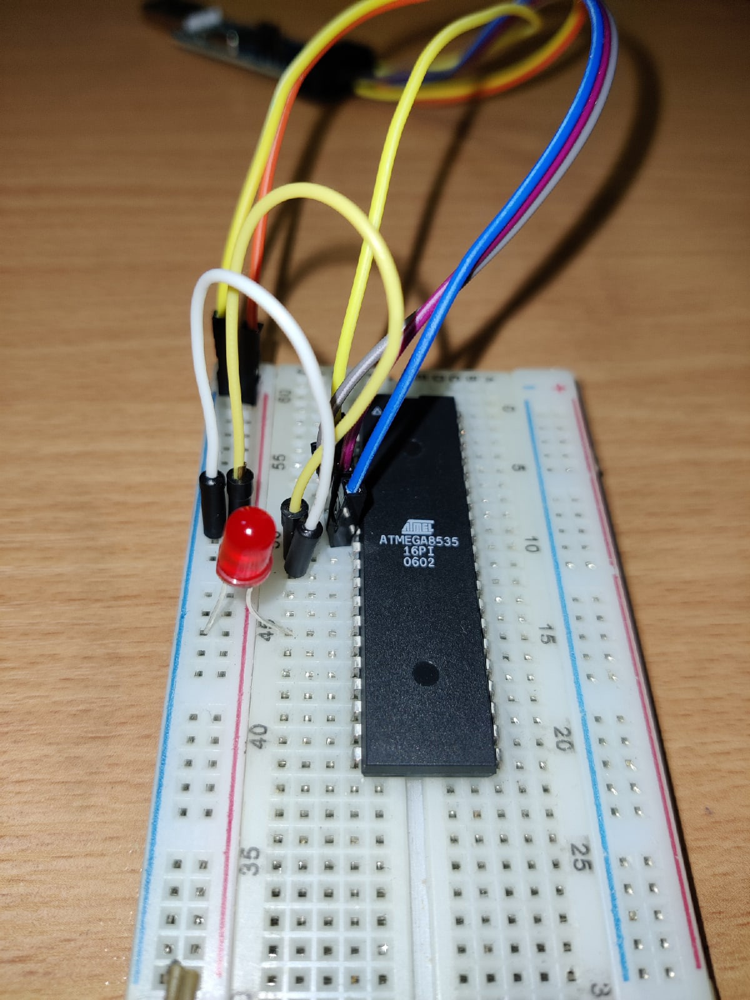

# AVR tutorial
После этого туториала вы сможете написать код на С и вгрузить его в atmega8535. Я рассчитываю, что вы уже познакомились с книгой Г.И. Донова "Программирование микроконтроллеров" и знаете С.

## Подготовка
1. atmega8535
2. USBASP
3. ```sudo apt-get install gcc-avr avr-libc avrdude``` - проследите, что все файлы корректно установились

## Схема
Подкоючить atmega8535 к USBASP совсем не сложно: 

Учтите, что на картинке НЕ atmega8535, а atmega328 но названия ножек VCC, MOSI... у них одинаковые.

USBASP:


Также, подкючите светодиод на PD0. У вас должно получиться примерно такое: 


## Программирование
Далее создаем main.c в репозитории проекта с таким кодом:
``` C
/*
* Hackaday.com AVR Tutorial firmware
* written by: Mike Szczys (@szczys)
* 10/24/2010
*
* ATmega168
* Blinks one LED conneced to PD0
*
* http://hackaday.com/2010/10/25/avr-programming-02-the-hardware/
*/
 
#include <avr/io.h>
#include <avr/interrupt.h>
 
int main(void)
{
 
  //Setup the clock
  cli();                        //Disable global interrupts
  TCCR1B |= 1<<CS11 | 1<<CS10;  //Divide by 64
  OCR1A = 15624;                //Count 15624 cycles for 1 second interrupt
  TCCR1B |= 1<<WGM12;           //Put Timer/Counter1 in CTC mode
  TIMSK |= 1<<OCIE1A;          //enable timer compare interrupt
  sei();                        //Enable global interrupts
 
                                //Setup the I/O for the LED
  DDRD |= (1<<0);               //Set PortD Pin0 as an output
  PORTD |= (1<<0);              //Set PortD Pin0 high to turn on LED
 
  while(1) { }                  //Loop forever, interrupts do the rest
}
 
ISR(TIMER1_COMPA_vect)          //Interrupt Service Routine
{
  PORTD ^= (1<<0);              //Use xor to toggle the LED
}
```
Код будет вам понятен, если вы разобрались в примере кода к Таймеру 0 в книге, написанной выше. Напишу пару комментариев.
Код: ```C REG |= 1<<BIT;``` устанавливает BIT-ый бит в Единицу в регистре REG. В этом несложно убедиться, если вспомнить, что такое битовые операции. Соотвественно, в ```C TCCR1B |= 1<<WGM12; ``` WGM12 - это число = 3, TCCR1B - это регистр = $2E.
Код: ```C PORTD ^= (1<<0);``` изменяет значение PA0. 
Код: ```C REG &= ~(1<<BIT);``` устанавливает BIT-ый бит в Ноль в регистре REG

## Вгружаем код!
Но сначала скомпилируем) avr-gcc - создает бинарный файл из С кода. Аналогично знакомому gcc.
```avr-gcc -Wall -g -Os -mmcu=atmega8535 -o main.bin main.c``` 

После компиляции вы можете проверить размер программы. Должно быть 136 byte.
``` avr-size -C main.bin```

Программа, вгружающая код принимает только .hex файлы, из-за этого нам надо сначала сделать:
``` avr-objcopy -j .text -j .data -O ihex main.bin main.hex ```

Теперь осталось только вгрузить код. Убедитесь, что вы подключиили программатор к компьютеру:
``` avrdude -p atmega8535 -c usbasp -U flash:w:main.hex:i -F -P usb -B12 -v ```

### Готово! Светодиод может мигать
Если не мигает, то
1. Проверьте подключение. Ошибка скорее всего здесь
2. Прочитайте внимательно, что написал avrdude

Также можно закинуть все это в Makefile:
```C 
MCU = atmega8535
F_CPU = 1200000
CC = avr-gcc
OBJCOPY = avr-objcopy
CFLAGS = -std=c99 -Wall -g -Os -mmcu=${MCU} -DF_CPU=${F_CPU} -I.
TARGET = main
SRCS = main.c

all:
	@${CC} ${CFLAGS} -o ${TARGET}.bin ${SRCS}
	@${OBJCOPY} -j .text -j .data -O ihex ${TARGET}.bin ${TARGET}.hex

flash:
	@avrdude -p ${MCU} -c usbasp -U flash:w:${TARGET}.hex:i -F -P usb -B12 -v

clean:
	@rm -f *.bin *.hex
```
Спасибо за внимание! С вас штраф - лайк)

